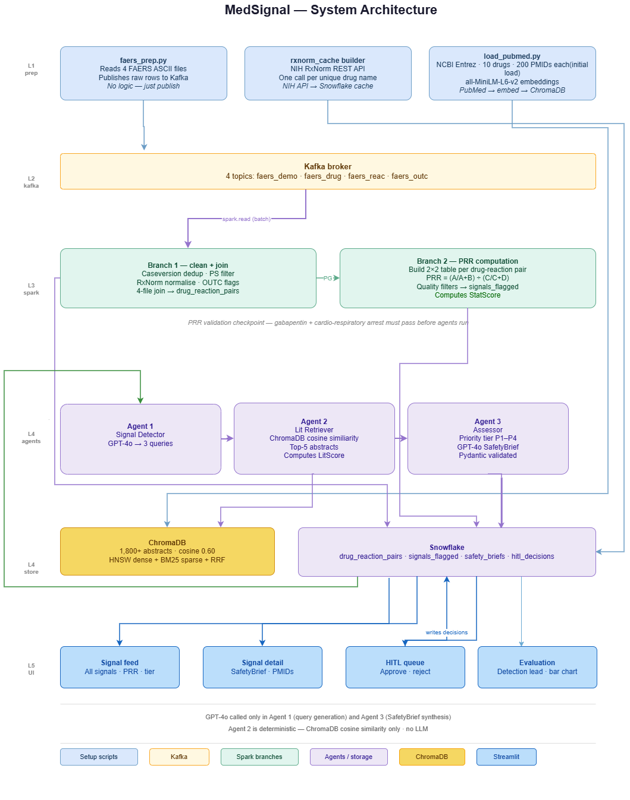

# MedSignal — Early Drug Safety Signal Detection

> A scalable pharmacovigilance pipeline that detects drug safety signals from FDA FAERS data faster than current manual processes, using Apache Kafka, Apache Spark, LangGraph agents, and GPT-4o.

**DAMG 7245 — Big Data and Intelligent Systems · Northeastern University · Spring 2026**  
**Team:** Samiksha · Prachi · Siddharth

---

## Table of Contents

- [What is MedSignal?](#what-is-medsignal)
- [Key Results](#key-results)
- [Architecture](#architecture)
- [Technology Stack](#technology-stack)
- [Repository Structure](#repository-structure)
- [Prerequisites](#prerequisites)
- [Environment Setup](#environment-setup)
- [Running the Pipeline](#running-the-pipeline)
- [Running the Application](#running-the-application)
- [Data Flow](#data-flow)
- [Agent Pipeline](#agent-pipeline)
- [Evaluation](#evaluation)
- [Testing](#testing)
- [API Reference](#api-reference)
- [Streamlit Pages](#streamlit-pages)

---

## What is MedSignal?

When a drug is approved, safety testing doesn't stop — it moves to the real world. The FDA Adverse Event Reporting System (FAERS) receives over 2 million reports per year from patients, doctors, and manufacturers. But detecting meaningful signals from this data is slow and manual: analysts join 7 files per quarter, compute statistics by hand, search PubMed for literature, and write safety narratives from scratch. By the time the FDA formally communicates a signal, it has often been visible in the data for months.

MedSignal automates this entire pipeline — from raw FAERS ASCII files to a prioritized, literature-grounded safety brief ready for human review — across five layers:

```
FAERS ZIPs → Kafka → Spark (PRR) → LangGraph Agents → Streamlit HITL
    L1          L2        L3               L4                 L5
```

---

## Key Results

| Metric | Value |
|--------|-------|
| Golden signals detected | 10 / 10 validated (100% precision) |
| Median detection lead time | 232 days before FDA communication |
| Total signals flagged | 7,830 across 2023 FAERS data |
| Input data processed | 5,755,720 drug-reaction pair rows |
| ChromaDB abstracts | 1,800+ PubMed abstracts across 10 golden drugs |
| Agent latency | < 120 seconds per signal |
| PRR validation | Gabapentin × cardio-respiratory arrest: confirmed |

---

## Architecture

```

```

---

## Technology Stack

| Component | Technology |
|-----------|-----------|
| Ingestion | Apache Kafka 7.5.0 (Confluent) |
| Processing | Apache Spark 3.5.x (PySpark) |
| Relational storage | Snowflake |
| Vector store | ChromaDB (local PersistentClient) |
| Embeddings | `all-MiniLM-L6-v2` (HuggingFace, 384-dim) |
| Agent framework | LangGraph |
| LLM | GPT-4o / GPT-4o mini (OpenAI) |
| Output validation | Pydantic v2 |
| API layer | FastAPI |
| Cache | Redis 7 |
| Frontend | Streamlit |
| Containerization | Docker Compose |
| Observability | Prometheus |
| Drug normalization | NIH RxNorm REST API |
| Dev environment | Poetry |

---

## Repository Structure

```
medsignal/
├── app/
│   ├── agents/
│   │   ├── agent1_detector.py      # StatScore + GPT-4o query generation
│   │   ├── agent2_retriever.py     # ChromaDB HNSW + BM25 + RRF + LitScore
│   │   ├── agent3_assessor.py      # Priority tier + SafetyBrief generation
│   │   ├── pipeline.py             # LangGraph pipeline orchestration
│   │   └── state.py                # SignalState TypedDict
│   ├── core/
│   │   └── llm_router.py           # GPT-4o → Claude Haiku fallback chain
│   ├── routers/
│   │   ├── signals.py              # GET /signals, GET /signals/count
│   │   ├── hitl.py                 # HITL queue and decision endpoints
│   │   ├── evaluation.py           # Lead time and precision endpoints
│   │   └── health.py               # Snowflake health check
│   ├── scripts/
│   │   ├── download_faers.py       # Download FAERS ZIPs from FDA portal
│   │   └── load_pubmed.py          # Fetch PubMed abstracts → ChromaDB
│   ├── services/
│   │   └── signal_service.py       # Business logic + Redis caching
│   └── utils/
│       ├── chromadb_client.py      # Shared ChromaDB client factory
│       ├── redis_client.py         # Redis cache helpers
│       └── snowflake_client.py     # Shared Snowflake connection factory
├── pipelines/
│   ├── spark_branch1.py            # Kafka → drug_reaction_pairs (~5M rows)
│   └── branch2_prr.py              # PRR computation → signals_flagged (~7K)
├── scripts/
│   └── faers_prep.py               # Thin Kafka producer for FAERS ASCII files
├── streamlit_app/
│   ├── app.py                      # Entry point
│   └── pages/
│       ├── 1_signal_feed.py        # All signals ranked by priority
│       ├── 2_signal_detail.py      # SafetyBrief + PMIDs + scores
│       ├── 3_hitl_queue.py         # Human review queue
│       ├── 4_evaluation.py         # Detection lead time + precision
│       ├── 5_metrics.py            # Prometheus observability
│       └── 6_evidence_explorer.py  # PubMed literature browser
├── evaluation/
│   ├── hallucination_check.py      # PMID fabrication detection
│   └── rubric_scorer.py            # SafetyBrief quality rubric (4 criteria)
├── tests/
│   ├── unit/                       # Pure logic tests, no external deps
│   ├── integration/                # Requires real Snowflake + ChromaDB
│   └── hypothesis/                 # Property-based tests
├── docker/
│   ├── docker-compose.yml          # Kafka + Zookeeper + Redis + ChromaDB
│   └── kafka_topics.sh             # Create 4 Kafka topics
├── data/
│   ├── schema.sql                  # PostgreSQL schema (reference)
│   └── snowflake_schema.sql        # Snowflake schema
└── main.py                         # FastAPI application entry point
```

---

## Prerequisites

- Python 3.11+
- Poetry (`pip install poetry`)
- Docker Desktop
- Java 11+ (required for Apache Spark)
- Git

**API keys required:**
- Snowflake account (free trial at snowflake.com)
- OpenAI API key (for GPT-4o)
- NCBI API key (free at ncbi.nlm.nih.gov/account — raises rate limit from 3 to 10 req/s)

---

## Environment Setup

**1. Clone the repository**
```bash
https://github.com/BigDataIA-Sat-Spring26-Team-2/Medsignal_Team2.git
cd medsignal
```

**2. Install dependencies**
```bash
poetry install
```

**3. Create `.env` file**
```bash
cp .env.example .env
```

Fill in all values:
```env
# Snowflake
SNOWFLAKE_ACCOUNT=your_account
SNOWFLAKE_USER=your_user
SNOWFLAKE_PASSWORD=your_password
SNOWFLAKE_DATABASE=MEDSIGNAL
SNOWFLAKE_SCHEMA=PUBLIC
SNOWFLAKE_WAREHOUSE=your_warehouse

# OpenAI
OPENAI_API_KEY=sk-...

# NCBI (PubMed)
NCBI_EMAIL=your@email.com
NCBI_API_KEY=your_ncbi_key

# ChromaDB
CHROMADB_MODE=local
CHROMADB_PATH=./chromadb_store

# Redis
REDIS_HOST=localhost
REDIS_PORT=6379

# Kafka
KAFKA_BOOTSTRAP_SERVERS=localhost:9092

# FastAPI
MEDSIGNAL_API_BASE=http://localhost:8000
```

**4. Initialize Snowflake schema**
```bash
# Run snowflake_schema.sql in your Snowflake worksheet
# Or use the Snowflake connector:
poetry run python -c "
import snowflake.connector, os
from dotenv import load_dotenv
load_dotenv()
# paste and execute contents of data/snowflake_schema.sql
"
```

**5. Start infrastructure**
```bash
cd docker
docker compose up -d
cd ..

# Create Kafka topics (wait ~15 seconds for Kafka to start first)
bash docker/kafka_topics.sh
```

---

## Running the Pipeline

Run these steps in order. Each step must complete before the next.

### Step 1 — Download FAERS data
```bash
poetry run python app/scripts/download_faers.py --year 2023
```
Downloads all four 2023 quarterly FAERS ZIP files from the FDA portal into `data/faers/`.

### Step 2 — Build RxNorm cache
```bash
poetry run python app/services/rxnorm_service.py
```
Calls NIH RxNorm API once per unique drug name and stores canonical names in Snowflake. Takes 30–60 minutes. Run once — safe to skip if cache is already built.

### Step 3 — Publish FAERS to Kafka
```bash
poetry run python scripts/faers_prep.py
```
Reads all four FAERS ASCII files and publishes raw records to 4 Kafka topics. No logic — just publish.

### Step 4 — Load PubMed abstracts into ChromaDB
```bash
poetry run python app/scripts/load_pubmed.py
```
Fetches up to 200 PubMed abstracts per golden drug, embeds them with `all-MiniLM-L6-v2`, and stores in ChromaDB. Takes 2–4 hours. Safe to interrupt and restart — already-loaded abstracts are skipped.

### Step 5 — Run Spark Branch 1 (data engineering)
```bash
poetry run python pipelines/spark_branch1.py
```
Reads Kafka topics → caseversion dedup → PS filter → RxNorm normalize → 4-file join → writes `drug_reaction_pairs` to Snowflake (~5.7M rows).

### Step 6 — Run Spark Branch 2 (PRR computation)
```bash
poetry run python pipelines/branch2_prr.py
```
Reads `drug_reaction_pairs` → computes PRR for all drug-reaction pairs → applies quality filters → writes `signals_flagged` to Snowflake (~7,000 signals). Includes gabapentin × cardio-respiratory arrest checkpoint.

### Step 7 — Run agent pipeline (optional — for investigated signals)
```bash
poetry run python app/agents/pipeline.py
```
Runs Agent 1 → Agent 2 → Agent 3 for all 10 golden signal drugs. Writes SafetyBriefs to `safety_briefs` in Snowflake. Individual signals can also be investigated on-demand from the Signal Detail page.

---

## Running the Application

**Terminal 1 — Start FastAPI backend**
```bash
poetry run uvicorn main:app --reload --port 8000
```
API docs available at: http://localhost:8000/docs

**Terminal 2 — Start Streamlit frontend**
```bash
poetry run streamlit run streamlit_app/app.py --server.port 8501
```
Dashboard available at: http://localhost:8501

**Kafka UI** (optional monitoring): http://localhost:8081

---

## Data Flow

```
FDA FAERS (quarterly ZIPs)
    │
    ▼
faers_prep.py
    │ publishes raw records
    ▼
Kafka (4 topics: demo, drug, reac, outc)
    │
    ▼
Spark Branch 1
    ├── Caseversion deduplication (keep highest per caseid)
    ├── PS filter (role_cod = PS only — primary suspect drugs)
    ├── RxNorm normalization (brand names → canonical names)
    ├── Four-file join on primaryid
    └── Pair-level deduplication
    │
    ▼ drug_reaction_pairs (~5.7M rows) → Snowflake
    │
    ▼
Spark Branch 2
    ├── PRR = (A/A+B) / (C/C+D) per drug-reaction pair
    ├── Threshold filters: A≥50, C≥200, drug_total≥1000, PRR≥2.0
    ├── Junk term filter (administrative MedDRA terms)
    ├── Single-quarter spike filter (>70% in one quarter)
    └── Late-surge filter (>85% in Q3+Q4)
    │
    ▼ signals_flagged (~7,000 signals) → Snowflake
    │
    ▼ [PRR validation checkpoint: gabapentin × cardio-respiratory arrest]
    │
    ▼
LangGraph Agent Pipeline
    ├── Agent 1: StatScore + GPT-4o → 3 PubMed search queries
    ├── Agent 2: HNSW + BM25 + RRF → top-5 abstracts + LitScore
    └── Agent 3: Priority tier + GPT-4o SafetyBrief + Pydantic validation
    │
    ▼ safety_briefs → Snowflake
    │
    ▼
Streamlit HITL Queue
    └── Analyst: Approve / Reject / Escalate → hitl_decisions → Snowflake
```

---

## Agent Pipeline

### Agent 1 — Signal Detector
- Reads signal from `signals_flagged`
- Calls GPT-4o to generate 3 domain-specific PubMed search queries
- Fallback chain: GPT-4o → Claude Haiku → template queries
- Guardrails: exactly 3 queries, ≥6 words each, all unique, drug name present

### Agent 2 — Literature Retriever (no LLM)
- HNSW dense retrieval via ChromaDB (`all-MiniLM-L6-v2`, cosine similarity ≥ 0.60)
- BM25 sparse retrieval for exact keyword matching
- Reciprocal Rank Fusion (RRF) combines 6 result sets (3 HNSW + 3 BM25)
- Computes `LitScore = (relevance × 0.70) + (volume × 0.30)`

### Agent 3 — Assessor
- Assigns priority tier (P1–P4) based on StatScore and LitScore matrix
- Calls GPT-4o to generate SafetyBrief with cited PMIDs
- Pydantic v2 validation with 1 retry on failure
- Citation guard: removes any PMID not in retrieved abstract set

### Priority Matrix

| | LitScore ≥ 0.5 | LitScore < 0.5 |
|---|---|---|
| StatScore ≥ 0.7 | P1 — Critical | P2 — Elevated |
| StatScore < 0.7 | P3 — Moderate | P4 — Monitor |

---

## Evaluation

MedSignal is evaluated against 10 golden drug-reaction pairs with documented 2023 FDA safety communications.

### Validation Queries

```sql
-- 1. Junk term filter check (should return 0 rows)
SELECT pt, COUNT(*) FROM signals_flagged
WHERE pt IN ('drug ineffective','off label use','product use issue',
             'no adverse event','drug interaction')
GROUP BY pt;

-- 2. All 10 golden signals present
SELECT drug_key, pt, prr, drug_reaction_count
FROM signals_flagged
WHERE drug_key IN ('dupilumab','gabapentin','pregabalin','levetiracetam',
                   'tirzepatide','semaglutide','empagliflozin',
                   'dapagliflozin','metformin','bupropion')
ORDER BY drug_key;

-- 3. PRR benchmark (gabapentin checkpoint)
SELECT drug_key, pt, prr, drug_reaction_count
FROM signals_flagged
WHERE drug_key = 'gabapentin' AND pt = 'cardio-respiratory arrest';

-- 4. Input completeness
SELECT COUNT(*) FROM drug_reaction_pairs;
-- Expected: 5,755,720
```

### SafetyBrief Quality Rubric

Run the rubric scorer to evaluate all 10 golden SafetyBriefs:
```bash
poetry run python evaluation/rubric_scorer.py
```

Four criteria (pass/fail per brief):
1. Signal identification — brief names drug and reaction correctly
2. Literature grounding — every claim traceable to a retrieved abstract
3. Citation accuracy — all PMIDs in brief_text appear in pmids_cited
4. Tier consistency — recommended action consistent with priority tier

Target: ≥ 7/10 briefs pass all four criteria.

---

## Testing

```bash
# Unit tests (no external dependencies)
poetry run pytest tests/unit/ -v -m unit

# Integration tests (requires Snowflake + ChromaDB)
poetry run pytest tests/integration/ -v -m integration

# Property-based tests
poetry run pytest tests/hypothesis/ -v

# Smoke tests
poetry run pytest tests/test_smoke.py -v

# All tests
poetry run pytest -v
```

---

## API Reference

| Method | Endpoint | Description |
|--------|----------|-------------|
| GET | `/signals` | List flagged signals (paginated, filterable) |
| GET | `/signals/count` | Total signal count + per-tier breakdown |
| GET | `/signals/{drug}/{pt}/brief` | Full SafetyBrief for one signal |
| POST | `/signals/{drug}/{pt}/investigate` | Trigger on-demand agent pipeline |
| GET | `/hitl/queue` | Signals pending human review |
| POST | `/hitl/decisions` | Submit approve/reject/escalate decision |
| GET | `/evaluation/summary` | Precision + lead time header metrics |
| GET | `/evaluation/lead-times` | Per-signal detection lead times |
| GET | `/evaluation/precision-recall` | Precision table for 10 golden signals |
| GET | `/health` | Snowflake connectivity check |
| GET | `/metrics` | System metrics (JSON) |
| GET | `/prometheus` | Prometheus exposition format |

---

## Streamlit Pages

| Page | Description |
|------|-------------|
| Signal Feed | 7,197 flagged signals ranked by priority tier with PRR, StatScore, LitScore, and outcome flags. Paginated (10 per load). |
| Signal Detail | Full SafetyBrief with cited PMIDs, score breakdowns, and on-demand investigation trigger. |
| HITL Queue | Human review queue sorted P1 → P4. Approve, reject, or escalate with optional reviewer note. Every decision logged immutably. |
| Evaluation Dashboard | Detection lead time bar chart and precision table for 10 golden signals. Precision: 100% (9/9 validated signals). |
| Metrics | Prometheus observability — agent latency, token costs, HITL queue depth, signal counts. |
| Evidence Explorer | Browse PubMed abstracts in ChromaDB by drug name with similarity scores. |

---

## Guardrails

Guardrails are applied at three points:

**Input** — Statistical threshold gate (PRR ≥ 2.0, A ≥ 50, C ≥ 200) + PRR validation checkpoint + three quality filters ensure the LLM never receives a statistically weak or artefact-driven signal.

**Output** — Pydantic v2 schema enforcement on SafetyBrief structure. Citation guard removes any fabricated PMID. Hallucination checker validates numerical claims against source data.

**Human** — Every investigated signal requires human approval. No automated approval path exists. Decisions are immutable — INSERT only, never UPDATE.

---

## References

- U.S. Food and Drug Administration. (2023). FDA Adverse Event Reporting System (FAERS). https://fis.fda.gov/extensions/FPD-QDE-FAERS/FPD-QDE-FAERS.html
- National Library of Medicine. (2023). PubMed / NCBI Entrez API. https://www.ncbi.nlm.nih.gov/home/develop/api/
- Evans, S.J.W., Waller, P.C., & Davis, S. (2001). Use of proportional reporting ratios (PRRs) for signal generation from spontaneous adverse drug reaction reports. *Pharmacoepidemiology and Drug Safety*, 10(6), 483–486.
- National Library of Medicine. (2023). RxNorm API. https://rxnav.nlm.nih.gov/
