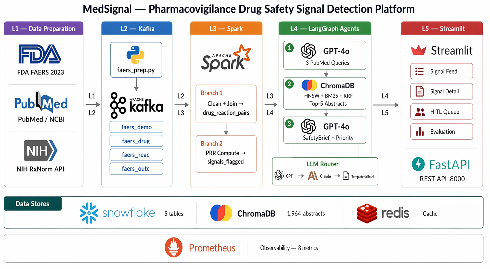
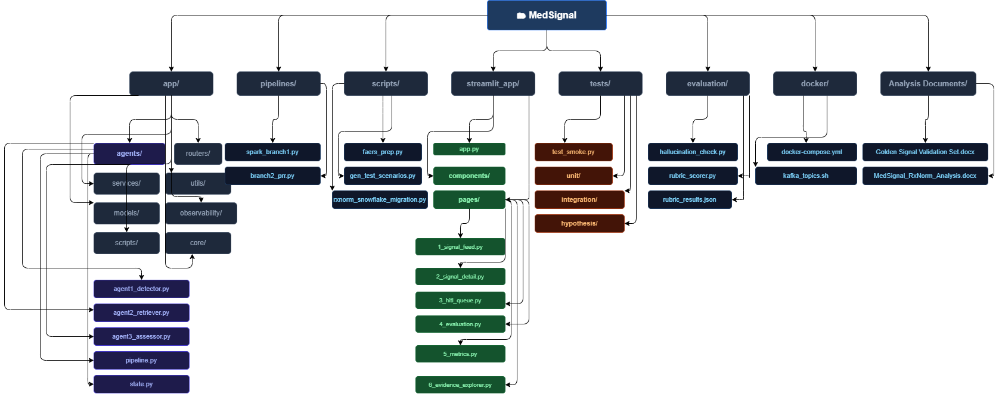

# MedSignal — Early Drug Safety Signal Detection

> A scalable pharmacovigilance pipeline that detects drug safety signals from FDA FAERS data faster than current manual processes, using Apache Kafka, Apache Spark (batch mode), LangGraph agents, and GPT-4o.

**DAMG 7245 — Big Data and Intelligent Systems · Northeastern University · Spring 2026**  
**Team:** Samiksha (Data Engineering Lead) · Prachi (Data Processing & LLM Lead) · Siddharth (Infrastructure & Quality Lead)


-Dashboard available at: http://44.208.5.68:8501
-Video Presentation: [Link](https://teams.microsoft.com/l/meetingrecap?driveId=b%218JzbXwgBnUSdAqSH29IUc_nkJ16sTrxFouB6QtyLUBzmQJqceZoeQrq-QzCRfP3w&driveItemId=01MVJ2O7QQQCR6ASW2SVCINOAZJA4RIB2S&sitePath=https%3A%2F%2Fnortheastern-my.sharepoint.com%2Fpersonal%2Fpradhan_prac_northeastern_edu%2FDocuments%2FRecordings%2FMeeting+in+Big+Data-20260424_134917-Meeting+Recording.mp4&fileUrl=https%3A%2F%2Fnortheastern-my.sharepoint.com%2Fpersonal%2Fpradhan_prac_northeastern_edu%2FDocuments%2FRecordings%2FMeeting+in+Big+Data-20260424_134917-Meeting+Recording.mp4&threadId=19%3Aabf4611dd15740b791eb005451a26c03%40thread.v2&organizerId=73bad307-9383-411b-aa1c-dc5d9b96cf0e&tenantId=a8eec281-aaa3-4dae-ac9b-9a398b9215e7&callId=d382618d-e35c-4831-8c7b-664f879b813a&threadType=GroupChat&meetingType=Unknown&subType=RecapSharingLink_RecapCore)
-Codelab:[Link](https://codelabs-preview.appspot.com/?file_id=11ECyMe8ZCYnVfF3022BSFNFvDJ8mFHqsue7Y_zau5RQ#0)


**Additional monitoring URLs:**

| Service | URL |
|---------|-----|
| Kafka UI | http://44.208.5.68:8081 |
| FastAPI docs | http://44.208.5.68:8000/docs |
| Health check | http://44.208.5.68:8000/health |
| Prometheus metrics | http://44.208.5.68:8000/prometheus |


---

## Table of Contents

- [What is MedSignal?](#what-is-medsignal)
- [Key Results](#key-results)
- [Architecture](#architecture)
- [Five-Layer Pipeline](#five-layer-pipeline)
- [Technology Stack](#technology-stack)
- [Repository Structure](#repository-structure)
- [Prerequisites](#prerequisites)
- [Environment Setup](#environment-setup)
- [Running the Pipeline](#running-the-pipeline)
- [Running the Application](#running-the-application)
- [Data Flow](#data-flow)
- [PubMed / ChromaDB Pipeline](#pubmed--chromadb-pipeline)
- [Agent Pipeline](#agent-pipeline)
- [Evaluation](#evaluation)
- [Testing](#testing)
- [API Reference](#api-reference)
- [Streamlit Pages](#streamlit-pages)
- [Guardrails](#guardrails)
- [LLM Cost Management](#llm-cost-management)
- [References](#references)

---

## What is MedSignal?

When a drug is approved, safety testing doesn't stop — it moves to the real world. The FDA Adverse Event Reporting System (FAERS) receives over 2 million reports per year from patients, doctors, and manufacturers. But detecting meaningful signals from this data is slow and manual: analysts join 7 files per quarter, compute statistics by hand, search PubMed for literature, and write safety narratives from scratch. By the time the FDA formally communicates a signal, it has often been visible in the data for months.

MedSignal automates this entire pipeline — from raw FAERS ASCII files to a prioritized, literature-grounded safety brief ready for human review — across five layers:

```
FAERS ZIPs → Kafka → Spark (PRR) → LangGraph Agents → Streamlit HITL
    L1          L2        L3               L4                 L5
```

---

## Key Results

| Metric | Value |
|--------|-------|
| Golden signals detected | 10 / 10 validated (100% precision) |
| Median detection lead time | ~230 days before FDA communication |
| Total signals flagged | 7,830 across 2023 FAERS data |
| Input data processed | 5,755,720 drug-reaction pair rows |
| ChromaDB abstracts | 1,800+ PubMed abstracts across 10 golden drugs (on-demand retrieval available for additional drugs) |
| Agent latency | < 100 seconds per signal |

---

## Architecture



The architecture diagram shows the full system across five layers. Snowflake holds all relational data (`drug_reaction_pairs`, `signals_flagged`, `safety_briefs`, `hitl_decisions`). ChromaDB runs as a Docker container (port 8002) storing 1,800+ PubMed embeddings. GPT-4o is called only in Agent 1 (query generation) and Agent 3 (SafetyBrief synthesis) — Agent 2 is fully deterministic.

---

## Five-Layer Pipeline

### Layer 1 — Data Preparation

Three scripts run once before the main pipeline:

- **`faers_prep.py`** — Reads raw FAERS ASCII files and publishes rows to 4 Kafka topics. No transformation logic — just publish.
- **`rxnorm_service.py`** — Calls NIH RxNorm API once per unique drug name and caches canonical names in Snowflake. No live API calls during Spark processing.
- **`load_pubmed.py`** — Fetches up to 200 PubMed abstracts per golden drug, embeds them with `all-MiniLM-L6-v2`, and stores in ChromaDB.

### Layer 2 — Kafka Ingestion

Kafka acts as a durable buffer between file ingestion and Spark processing. All four topics are populated in a single run of `faers_prep.py`. When a new quarter arrives, the script runs again for that quarter only — Spark picks up new records using Kafka offsets without reprocessing earlier quarters.

Topics (4 partitions each, replication factor 1):

| Topic | Source File | Content |
|-------|------------|---------|
| `faers_demo` | DEMO*.txt | Patient demographics |
| `faers_drug` | DRUG*.txt | Drug records per case |
| `faers_reac` | REAC*.txt | MedDRA reaction terms |
| `faers_outc` | OUTC*.txt | Outcome codes |

### Layer 3 — Spark Processing (Batch Mode)

> **Important:** Spark reads Kafka topics as **static batch dataframes** using `spark.read` — not `spark.readStream`. FAERS data is a fixed quarterly dataset; all records exist at the time Spark runs. There is no late-arriving data, no watermarking, and no streaming state management.

**Branch 1 — Join, Dedup, Normalize** (`pipelines/spark_branch1.py`):
1. Deduplicate DEMO — keep highest `caseversion` per `caseid`
2. Filter DRUG to `role_cod = PS` only (Primary Suspect)
3. Normalize drug names via RxNorm cache broadcast join
4. Four-file join on `primaryid` (DRUG ⋈ REAC ⋈ DEMO ⋈ OUTC)
5. Pair-level deduplication on `(primaryid, drug_key, pt)`
6. Write ~5.7M rows to Snowflake `drug_reaction_pairs`

**Branch 2 — PRR Computation** (`pipelines/branch2_prr.py`):
1. Build 2×2 contingency table per drug-reaction pair
2. Compute PRR = (A/A+B) / (C/C+D)
3. Apply threshold filters: A≥50, C≥200, `drug_total`≥1,000, PRR≥2.0
4. Apply quality filters: junk term filter, single-quarter spike filter (>70%), late-surge filter (>85% in Q3+Q4)
5. Write ~7,000 signals to Snowflake `signals_flagged`
6. Run gabapentin × cardio-respiratory arrest checkpoint — pipeline halts if this signal is absent

### Layer 4 — LangGraph Agent Pipeline

Three agents run sequentially for each investigated signal. The pipeline is deterministic — always Agent 1 → Agent 2 → Agent 3 in that order, with MemorySaver checkpointing state at each boundary.

See [Agent Pipeline](#agent-pipeline) for full details.

### Layer 5 — Streamlit HITL Interface

Six pages allow analysts to browse signals, read SafetyBriefs, trigger on-demand investigations, and submit human review decisions. Every decision is recorded immutably in Snowflake `hitl_decisions` (INSERT only, never UPDATE).

---

## Technology Stack

| Component | Technology | Notes |
|-----------|-----------|-------|
| Ingestion | Apache Kafka 7.5.0 (Confluent) | 4 topics, 4 partitions each |
| Processing | Apache Spark 3.5.x (PySpark) | Batch mode — `spark.read`, not `spark.readStream` |
| Relational storage | Snowflake | All four tables: drug_reaction_pairs, signals_flagged, safety_briefs, hitl_decisions |
| Vector store | ChromaDB | Docker container (port 8002); `local` mode uses PersistentClient, `cloud` mode uses HttpClient |
| Embeddings | `all-MiniLM-L6-v2` (HuggingFace, 384-dim) | Runs locally, no API cost |
| Agent framework | LangGraph | Stateful 3-agent pipeline with MemorySaver checkpointing |
| LLM (primary) | GPT-4o (OpenAI) | Production model; `gpt-4o-mini` used during development via `OPENAI_MODEL` in `.env` |
| LLM (fallback) | Claude Haiku (`claude-haiku-4-5-20251001`) | Automatic fallback if primary model fails |
| Output validation | Pydantic v2 | SafetyBrief schema enforcement with 1 retry |
| API layer | FastAPI | Uvicorn; docs at localhost:8000/docs |
| Cache | Redis 7 | Read-through cache for Snowflake queries (3–8s cold start avoided) |
| Frontend | Streamlit | 6 pages; port 8501 |
| Containerization | Docker Compose | Kafka + Zookeeper + Redis + ChromaDB + Kafka UI |
| Observability | Prometheus | Agent latency, token costs, HITL queue depth |
| Drug normalization | NIH RxNorm REST API | Called once per drug name, results cached in Snowflake |
| Dev environment | Poetry | Python 3.11+ |

---

## Repository Structure


---

## Prerequisites

- Python 3.11+
- Poetry (`pip install poetry`)
- Docker Desktop
- Java 11+ (required for Apache Spark)
- Git

**API keys and accounts required:**

| Service | Purpose | Notes |
|---------|---------|-------|
| Snowflake | Relational storage for all pipeline outputs | Free trial at snowflake.com |
| OpenAI | GPT-4o / GPT-4o-mini for Agents 1 and 3 | Required |
| NCBI | PubMed abstract fetching | Free at ncbi.nlm.nih.gov/account — raises rate limit from 3 to 10 req/s |
| ChromaDB Cloud | Optional — cloud vector store | Only needed if `CHROMADB_MODE=cloud` |

---

## Environment Setup

**1. Clone the repository**
```bash
git clone https://github.com/BigDataIA-Sat-Spring26-Team-2/Medsignal_Team2.git
cd medsignal
```

**2. Install dependencies**
```bash
poetry install
```

**3. Create `.env` file**
```bash
cp .env.example .env
```

Fill in all values:
```env
# Snowflake — relational storage for all pipeline tables
SNOWFLAKE_ACCOUNT=your_account        # e.g. abc12345.us-east-1
SNOWFLAKE_USER=your_user
SNOWFLAKE_PASSWORD=your_password
SNOWFLAKE_DATABASE=MEDSIGNAL
SNOWFLAKE_SCHEMA=PUBLIC
SNOWFLAKE_WAREHOUSE=your_warehouse

# OpenAI — used by Agent 1 (query generation) and Agent 3 (SafetyBrief)
OPENAI_API_KEY=sk-...
OPENAI_MODEL=gpt-4o                   # production model; use gpt-4o-mini during development to reduce cost

# LLM fallback — Claude Haiku kicks in if primary model fails
FALLBACK_MODEL=claude-haiku-4-5-20251001
ANTHROPIC_API_KEY=sk-ant-...          # required if using Claude fallback

# LLM cost controls
DAILY_BUDGET_USD=50.00                # hard spend cap per day; use 10.00 during development with gpt-4o-mini
MAX_TOKENS_QUERY=500000               # token budget for Agent 1 (query generation)
MAX_TOKENS_BRIEF=5000000              # token budget for Agent 3 (brief generation)

# NCBI (PubMed abstract fetching)
NCBI_EMAIL=your@email.com
NCBI_API_KEY=your_ncbi_key

# ChromaDB — set CHROMADB_MODE=local (default) or cloud
CHROMADB_MODE=local
CHROMADB_PATH=./chromadb_store        # used when CHROMADB_MODE=local

# ChromaDB Cloud (only required if CHROMADB_MODE=cloud)
CHROMA_TENANT=your_tenant
CHROMA_DATABASE=medsignal
CHROMA_API_KEY=your_chroma_key

# Redis — read-through cache for Snowflake queries
REDIS_HOST=localhost
REDIS_PORT=6379

# Kafka
KAFKA_BOOTSTRAP_SERVERS=localhost:9092

# FastAPI
MEDSIGNAL_API_BASE=http://localhost:8000
```

**4. Initialize Snowflake schema**
```bash
# Run snowflake_schema.sql in your Snowflake worksheet
# This creates: drug_reaction_pairs, signals_flagged, safety_briefs, hitl_decisions, rxnorm_cache
```

**5. Start infrastructure (Docker)**
```bash
cd docker
docker compose up -d
cd ..
```

This starts:
- **Kafka** (port 9092) + Zookeeper (port 2181)
- **kafka-init** container — auto-creates all 4 topics on startup
- **ChromaDB** (port 8002) — persistent vector store for PubMed embeddings
- **Redis** (port 6379) — query result cache
- **Kafka UI** (port 8081) — optional monitoring dashboard

> **Note:** Kafka topics are created automatically by the `kafka-init` container. The `docker/kafka_topics.sh` script is a backup for manual creation only.

---

## Running the Pipeline

Run these steps in order. Each step must complete before the next begins.

### Step 1 — Download FAERS data
```bash
poetry run python app/scripts/download_faers.py --year 2023
```
Downloads all four 2023 quarterly FAERS ZIP files from the FDA portal into `data/faers/`. Each ZIP is extracted and the target files (DEMO, DRUG, REAC, OUTC) are retained.

### Step 2 — Build RxNorm cache
```bash
poetry run python app/services/rxnorm_service.py
```
Calls NIH RxNorm API once per unique drug name and stores canonical names in Snowflake `rxnorm_cache`. Takes 30–60 minutes. Safe to skip if the cache already exists — Spark reads this table at Branch 1 runtime via a broadcast join, so no live API calls are made during processing.

### Step 3 — Publish FAERS to Kafka
```bash
poetry run python scripts/faers_prep.py
```
Reads all four FAERS ASCII files and publishes raw records to 4 Kafka topics. No transformation logic — just publish. Already-published quarters are detected automatically and skipped (use `--force` to republish).

```bash
# Options
poetry run python scripts/faers_prep.py --year 2023 --quarters 1 2    # specific quarters
poetry run python scripts/faers_prep.py --dry-run                      # count rows without sending
poetry run python scripts/faers_prep.py --force                        # republish (creates duplicates — use after docker compose down -v)
```

### Step 4 — Load PubMed abstracts into ChromaDB
```bash
poetry run python app/scripts/load_pubmed.py
```
Fetches up to 200 PubMed abstracts per golden drug using NCBI ESearch + EFetch, embeds each with `all-MiniLM-L6-v2`, and stores vectors in ChromaDB. Takes 2–4 hours. Safe to interrupt and restart — already-loaded PMIDs are skipped automatically.

Target: ≥1,800 abstracts total across 10 golden drugs.

### Step 5 — Run Spark Branch 1 (data engineering)
```bash
# Full run (all 4 quarters)
poetry run python pipelines/spark_branch1.py

# Single quarter (recommended during development)
poetry run python pipelines/spark_branch1.py --quarter 2023Q1

# With row limit for quick smoke test
poetry run python pipelines/spark_branch1.py --quarter 2023Q1 --limit 500000

# Write to test table
poetry run python pipelines/spark_branch1.py --quarter 2023Q1 --table drug_reaction_pairs_test
```

Reads Kafka topics (static batch) → caseversion dedup → PS filter → RxNorm normalize → 4-file join → writes `drug_reaction_pairs` to Snowflake (~5.7M rows). Runs a PRR validation checkpoint at the end — pipeline halts if gabapentin × cardio-respiratory arrest is absent.

### Step 6 — Run Spark Branch 2 (PRR computation)
```bash
poetry run python pipelines/branch2_prr.py
```
Reads `drug_reaction_pairs` → computes PRR for all drug-reaction pairs → applies quality filters → writes `signals_flagged` to Snowflake (~7,000 signals).

### Step 7 — Run agent pipeline (optional — for pre-investigated signals)
```bash
poetry run python app/agents/pipeline.py
```
Runs Agent 1 → Agent 2 → Agent 3 for all 10 golden signal drugs in batch mode. Writes SafetyBriefs to `safety_briefs` in Snowflake. Individual signals can also be investigated on-demand from the Signal Detail page via the FastAPI endpoint.

---

## Running the Application

**Terminal 1 — Start FastAPI backend**
```bash
poetry run uvicorn app.main:app --reload --port 8000
```
API docs available at: http://localhost:8000/docs

**Terminal 2 — Start Streamlit frontend**
```bash
poetry run streamlit run streamlit_app/app.py --server.port 8501
```
Dashboard available at: http://localhost:8501

**Additional monitoring URLs:**

| Service | URL |
|---------|-----|
| Kafka UI | http://localhost:8081 |
| ChromaDB | http://localhost:8002 |
| FastAPI docs | http://localhost:8000/docs |
| Prometheus metrics | http://localhost:8000/prometheus |

---

## Data Flow

```
FDA FAERS (quarterly ZIPs — 2023 Q1–Q4)
    │
    ▼
faers_prep.py
    │ publishes raw rows — no transformation
    ▼
Kafka (4 topics: faers_demo, faers_drug, faers_reac, faers_outc)
    │ 4 partitions each — Spark reads all 4 simultaneously
    ▼
Spark Branch 1  [spark.read — static batch, not spark.readStream]
    ├── Caseversion deduplication (window function — keep highest per caseid)
    ├── PS filter (role_cod = PS — primary suspect drugs only)
    ├── RxNorm normalization (brand names → canonical names via broadcast join)
    ├── Four-file join on primaryid (DRUG ⋈ REAC ⋈ DEMO ⋈ OUTC)
    └── Pair-level deduplication on (primaryid, drug_key, pt)
    │
    ▼ drug_reaction_pairs (~5.7M rows) → Snowflake
    │
    ▼ [PRR validation checkpoint: gabapentin × cardio-respiratory arrest]
    │ Pipeline halts here if checkpoint fails
    ▼
Spark Branch 2
    ├── PRR = (A/A+B) / (C/C+D) per drug-reaction pair
    ├── Threshold filters: A≥50, C≥200, drug_total≥1,000, PRR≥2.0
    ├── Junk term filter (administrative MedDRA terms removed)
    ├── Single-quarter spike filter (>70% of cases in one quarter)
    └── Late-surge filter (>85% of cases in Q3+Q4)
    │
    ▼ signals_flagged (~7,000 signals) → Snowflake
    │
    ▼
LangGraph Agent Pipeline  [triggered batch or on-demand]
    ├── Agent 1: reads StatScore from signals_flagged → GPT-4o → 3 PubMed queries
    │            Fallback: GPT-4o-mini → Claude Haiku → template queries
    ├── Agent 2: HNSW dense (ChromaDB) + BM25 sparse → RRF → top-5 abstracts + LitScore
    │            No LLM call — fully deterministic
    └── Agent 3: StatScore × LitScore → priority tier → GPT-4o SafetyBrief + Pydantic validation
    │
    ▼ safety_briefs → Snowflake  (Redis cache invalidated immediately after write)
    │
    ▼
Streamlit HITL Queue
    └── Analyst: Approve / Reject / Escalate + optional note → hitl_decisions → Snowflake
                 INSERT only — decisions are immutable, never updated
```

---

## PubMed / ChromaDB Pipeline

The literature retrieval system is built once before the agent pipeline runs and queried on-demand thereafter.

```
10 golden signal drugs
    │
    ▼ NCBI ESearch
    │ Query: drug name + "adverse safety toxicity risk"
    │ Returns: up to 200 PMIDs per drug
    ▼
PMID deduplication
    │ Within each drug: unique PMIDs only
    │ Across drugs: same PMID stored separately per drug (intentional)
    ▼
NCBI EFetch (batches of 20)
    │ Extracts: title · abstract · year · journal · authors · MeSH terms
    ▼
Filter empty abstracts
    │ Skip: conference abstracts, editorials, papers without abstracts
    │ Result: 180–193 usable abstracts per drug from 200 fetched
    ▼
Embed with all-MiniLM-L6-v2
    │ 384-dimensional vectors, runs locally, no API cost
    │ Cosine similarity threshold: 0.60 (calibrated from POC)
    ▼
Build BM25 sparse index
    │ Tokenise title + abstract → rank-bm25 index
    │ Saved alongside ChromaDB — used for hybrid retrieval at query time
    ▼
Store in ChromaDB
    │ Metadata per record: drug_name · pmid · year · journal
    │ Persists to disk — incremental adds, no rebuild needed
    ▼
Output: Hybrid retrieval ready
    ChromaDB (HNSW dense) + BM25 (sparse) fused via Reciprocal Rank Fusion
    Agent 2 queries at signal investigation time — no re-embedding needed
```

**ChromaDB modes:**
- `CHROMADB_MODE=local` (default) — PersistentClient at `CHROMADB_PATH`
- `CHROMADB_MODE=cloud` — HttpClient connecting to ChromaDB Cloud (`CHROMA_TENANT`, `CHROMA_DATABASE`, `CHROMA_API_KEY` required)

---

## Agent Pipeline

The LangGraph pipeline is deterministic: Agent 1 → Agent 2 → Agent 3 → END. MemorySaver checkpoints state at each node boundary for debugging.

### Agent 1 — Signal Detector

- Reads signal from `signals_flagged` — `stat_score` is pre-computed by Branch 2, not recomputed here
- Builds a severity string from death/hospitalization/life-threatening flags
- Calls GPT-4o via LLMRouter to generate 3 domain-specific PubMed search queries
- Fallback chain (fully automatic via LLMRouter): GPT-4o-mini → Claude Haiku → template queries
- **Guardrails:** exactly 3 queries, ≥6 words each, all unique, drug name present in each

**Example — why GPT-4o over templates:**
```
Drug: empagliflozin + diabetic ketoacidosis
Template:  "empagliflozin diabetic ketoacidosis mechanism pharmacology"
GPT-4o:    "empagliflozin SGLT2 inhibitor euglycemic ketoacidosis mechanism"
           "empagliflozin diabetic ketoacidosis incidence risk factors"
           "empagliflozin ketoacidosis outcomes hospitalisation management"
```

### Agent 2 — Literature Retriever (no LLM)

- HNSW dense retrieval via ChromaDB (`all-MiniLM-L6-v2`, cosine similarity ≥ 0.60, filtered by `drug_name` metadata)
- BM25 sparse retrieval for exact keyword matching across full corpus
- Reciprocal Rank Fusion (RRF) combines 6 result sets (3 HNSW + 3 BM25 — one per search query)
- BM25 index is built once from full ChromaDB corpus using paginated fetches (300 docs/page) to compute accurate IDF scores
- Computes `LitScore = (relevance × 0.70) + (volume × 0.30)`

### Agent 3 — Assessor

- Assigns priority tier (P1–P4) from StatScore × LitScore matrix
- Calls GPT-4o to generate SafetyBrief with cited PMIDs
- Pydantic v2 validation with 1 automatic retry on schema failure
- **Citation guard:** removes any PMID in the brief not present in the retrieved abstract set (prevents hallucination)
- **Hallucination checker:** validates numerical claims (PRR, case counts) against source data

### Priority Matrix

| | LitScore ≥ 0.5 | LitScore < 0.5 |
|---|---|---|
| **StatScore ≥ 0.7** | P1 — Critical | P2 — Elevated |
| **StatScore < 0.7** | P3 — Moderate | P4 — Monitor |

StatScore and LitScore are kept independent — collapsing two meaningful dimensions into a single score would reduce transparency for the human reviewer.

### On-Demand Investigation

Any signal can be investigated on-demand from the Signal Detail page:
```
POST /signals/{drug_key}/{pt}/investigate
```
If ChromaDB has fewer than 50 abstracts for the drug, `load_pubmed.py` is called automatically before the agent pipeline runs (~30–60 seconds first time, instant on subsequent calls).

---

## Evaluation

MedSignal is evaluated against 10 golden drug-reaction pairs with documented 2023 FDA safety communications.

**Golden signal drugs:** dupilumab · gabapentin · pregabalin · levetiracetam · tirzepatide · semaglutide · empagliflozin · dapagliflozin · metformin · bupropion

### Validation Queries

```sql
-- 1. Junk term filter check (should return 0 rows)
SELECT pt, COUNT(*) FROM signals_flagged
WHERE pt IN ('drug ineffective','off label use','product use issue',
             'no adverse event','drug interaction')
GROUP BY pt;

-- 2. All 10 golden signals present
SELECT drug_key, pt, prr, drug_reaction_count
FROM signals_flagged
WHERE drug_key IN ('dupilumab','gabapentin','pregabalin','levetiracetam',
                   'tirzepatide','semaglutide','empagliflozin',
                   'dapagliflozin','metformin','bupropion')
ORDER BY drug_key;

-- 3. PRR benchmark checkpoint (gabapentin)
SELECT drug_key, pt, prr, drug_reaction_count
FROM signals_flagged
WHERE drug_key = 'gabapentin' AND pt = 'cardio-respiratory arrest';

-- 4. Input completeness
SELECT COUNT(*) FROM drug_reaction_pairs;
-- Expected: 5,755,720
```

### SafetyBrief Quality Rubric

```bash
poetry run python evaluation/rubric_scorer.py
```

Four pass/fail criteria per brief:
1. **Signal identification** — brief names drug and reaction correctly
2. **Literature grounding** — every claim traceable to a retrieved abstract
3. **Citation accuracy** — all PMIDs in `brief_text` appear in `pmids_cited`
4. **Tier consistency** — recommended action is consistent with assigned priority tier

Target: ≥7/10 briefs pass all four criteria.

### Hallucination Check

```bash
poetry run python evaluation/hallucination_check.py
```

Validates SafetyBriefs for numerical accuracy (PRR, case counts, outcome rates) and priority-action consistency.

---

## Testing

```bash
# Unit tests (no external dependencies)
poetry run pytest tests/unit/ -v -m unit

# Integration tests (requires Snowflake + ChromaDB running)
poetry run pytest tests/integration/ -v -m integration

# Property-based tests
poetry run pytest tests/hypothesis/ -v

# Smoke tests
poetry run pytest tests/test_smoke.py -v

# All tests
poetry run pytest -v
```

**Test coverage by component:**

| Component | Unit | Integration |
|-----------|------|-------------|
| Agent 1 (detector) | ✓ | |
| Agent 2 (retriever) | ✓ | ✓ |
| Agent 3 (assessor) | ✓ | ✓ |
| Spark Branch 1 | ✓ | ✓ |
| Spark Branch 2 (PRR) | ✓ | |
| LLM Router | ✓ | |
| HITL queue | ✓ | ✓ |
| Signals API | ✓ | |
| Redis cache | ✓ | ✓ |
| Evaluation | ✓ | ✓ |
| Hallucination check | ✓ | |
| On-demand investigation | | ✓ |

---

## API Reference

| Method | Endpoint | Description |
|--------|----------|-------------|
| GET | `/signals` | List flagged signals (paginated, filterable by tier/drug) |
| GET | `/signals/count` | Total signal count + per-tier breakdown |
| GET | `/signals/{drug}/{pt}/brief` | Full SafetyBrief for one signal |
| POST | `/signals/{drug}/{pt}/investigate` | Trigger on-demand agent pipeline for one signal |
| GET | `/hitl/queue` | Signals pending human review, sorted P1→P4 |
| POST | `/hitl/decisions` | Submit approve / reject / escalate decision |
| GET | `/evaluation/summary` | Precision + lead time header metrics |
| GET | `/evaluation/lead-times` | Per-signal detection lead times vs FDA communication dates |
| GET | `/evaluation/precision-recall` | Precision table for 10 golden signals |
| GET | `/health` | Snowflake connectivity check |
| GET | `/metrics` | System metrics (JSON) |
| GET | `/prometheus` | Prometheus exposition format |

Full interactive docs: http://localhost:8000/docs

---

## Streamlit Pages

| Page | Route | Description |
|------|-------|-------------|
| Signal Feed | `/signal_feed` | 7,830 flagged signals ranked by priority tier with PRR, StatScore, LitScore, and outcome flags. Paginated (10 per load). |
| Signal Detail | `/signal_detail` | Full SafetyBrief with cited PMIDs, score breakdowns, priority tier, and on-demand investigation trigger. |
| HITL Queue | `/hitl_queue` | Human review queue sorted P1→P4. Approve, reject, or escalate with optional reviewer note. Every decision logged immutably. |
| Evaluation Dashboard | `/evaluation` | Detection lead time bar chart and precision table for 10 golden signals. |
| Metrics | `/metrics` | Prometheus observability — agent latency, token costs, HITL queue depth, signal counts. |
| Evidence Explorer | `/evidence_explorer` | Browse PubMed abstracts stored in ChromaDB by drug name with similarity scores. |

---

## Guardrails

Guardrails are applied at three points:

**Input** — Statistical threshold gate (PRR ≥ 2.0, A ≥ 50, C ≥ 200, drug_total ≥ 1,000) + PRR validation checkpoint + three quality filters (junk term, spike, late-surge) ensure the LLM never receives a statistically weak or artefact-driven signal.

**Output** — Pydantic v2 schema enforcement on SafetyBrief structure with 1 automatic retry. Citation guard removes any fabricated PMID not present in the retrieved abstract set. Hallucination checker validates numerical claims against source Snowflake data.

**Human** — Every investigated signal requires human approval before acting on it. No automated approval path exists. Decisions are immutable — INSERT only, never UPDATE.

---

## LLM Cost Management

The `LLMRouter` class enforces two independent budget controls:

**Run-level token budget** (resets per pipeline run):
- `query_generation` (Agent 1): 500,000 tokens per run (~2,270 calls)
- `brief_generation` (Agent 3): 5,000,000 tokens per run (~2,380 calls)
- Override via `MAX_TOKENS_QUERY` and `MAX_TOKENS_BRIEF` in `.env`

**Daily spend budget** (shared across instances, resets at midnight):
- Production default: $50.00/day — covers a full gpt-4o run with buffer
- Development: set `DAILY_BUDGET_USD=10.00` when using gpt-4o-mini to reduce cost

**Model configuration:**
- **Production** → `OPENAI_MODEL=gpt-4o` (default in `.env`)
- **Development** → `OPENAI_MODEL=gpt-4o-mini` to keep costs low during iteration

**Approximate cost at scale (~2,000 signals):**

| Mode | Model | Estimated cost |
|------|-------|----------------|
| Development | gpt-4o-mini | ~$0.93 per full run |
| Production | gpt-4o | ~$32 per full run |

---

## References

- U.S. Food and Drug Administration. (2023). FDA Adverse Event Reporting System (FAERS). https://fis.fda.gov/extensions/FPD-QDE-FAERS/FPD-QDE-FAERS.html
- National Library of Medicine. (2023). PubMed / NCBI Entrez API. https://www.ncbi.nlm.nih.gov/home/develop/api/
- Evans, S.J.W., Waller, P.C., & Davis, S. (2001). Use of proportional reporting ratios (PRRs) for signal generation from spontaneous adverse drug reaction reports. *Pharmacoepidemiology and Drug Safety*, 10(6), 483–486.
- National Library of Medicine. (2023). RxNorm API. https://rxnav.nlm.nih.gov/
- Robertson, S. & Zaragoza, H. (2009). The Probabilistic Relevance Framework: BM25 and Beyond. *Foundations and Trends in Information Retrieval*, 3(4), 333–389.
